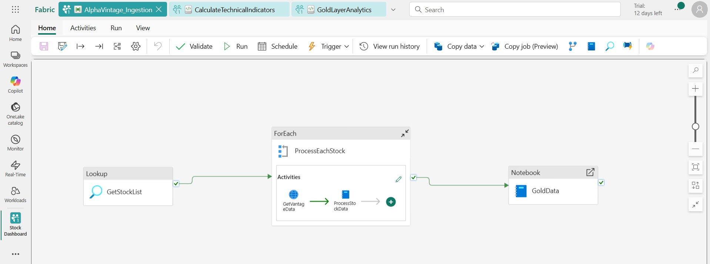

# Real-Time Stock Market Analytics Platform with Microsoft Fabric

This project is an end-to-end data pipeline built entirely within Microsoft Fabric. It ingests real-time stock data from the Alpha Vantage API, processes it through a Medallion architecture (Bronze, Silver, Gold), and generates actionable trading insights.

## 📊 Architecture & Data Flow

The pipeline is orchestrated within Microsoft Fabric to automate the data flow from raw ingestion to curated analytics.

The pipeline follows a multi-layered approach:

### 1. 🥉 Bronze Layer: Raw Data Ingestion
Raw, unaltered stock data is fetched from the **Alpha Vantage API**. A Fabric pipeline handles the orchestration, ingesting the time-series data and storing it in the `bronze_stock_data` Delta table.

### 2. 🥈 Silver Layer: Cleansing and Feature Engineering
The `CalculateTechnicalIndicators.ipynb` notebook processes the raw data from the Bronze layer. It performs cleansing and calculates key technical indicators to enrich the dataset.

* **Calculations Include:**
    * Simple Moving Averages (SMA)
    * Relative Strength Index (RSI)
    * Bollinger Bands
    * Volume Analysis
* **Output Table:** `silver_stock_analytics`

### 3. 🥇 Gold Layer: Business Aggregation & Insights
The `GoldLayerAnalytics.ipynb` notebook consumes the enriched data from the Silver layer to generate high-level, business-ready insights. These aggregated tables are designed for direct use in analytics, reporting, or downstream applications.

* **Key Output Tables:**
    * `gold_trading_signals`: Generates BUY/SELL signals based on RSI and Bollinger Band movements.
    * `gold_stock_rankings`: Scores and ranks stocks based on momentum, volume, and technical strength.
    * `gold_hourly_patterns`: Analyzes intraday performance to identify the best-performing hours.
    * `gold_volatility_metrics`: Calculates daily volatility and price range percentages.
    * `gold_anomalies`: Detects unusual price or volume movements.

## 🛠️ Technologies Used

* **Platform:** Microsoft Fabric
* **Data Processing:** Apache Spark (via PySpark notebooks)
* **Storage:** OneLake (Delta Lake format)
* **Data Source:** Alpha Vantage API

## ⚙️ Automation & Scheduling

The entire analytics process is designed for full automation within the Microsoft Fabric ecosystem.

### Scheduled Pipeline Runs
The main Fabric pipeline can be configured with a schedule trigger. This allows for automatic execution at set intervals (e.g., hourly, daily after market close) to ensure the analytical tables in the Gold layer are consistently updated with the latest data without any manual intervention.

### Automated Email Reports
Using **Microsoft Fabric Data Activator** or by adding an **Office 365 Outlook** activity at the end of the pipeline, automated email notifications can be sent upon successful completion. These emails can:
* Summarize key findings, such as new trading signals or anomalies.
* Attach a CSV export of the latest stock rankings.
* Provide a direct link to a Power BI dashboard visualizing the results.

## 📓 Repository Contents

* `CalculateTechnicalIndicators.ipynb`: The Spark notebook for transforming data from the Bronze to the Silver layer.
* `GoldLayerAnalytics.ipynb`: The Spark notebook for aggregating Silver data into the Gold layer for final analysis.
* `pipeline.json`: The JSON definition of the Microsoft Fabric pipeline, detailing all activities, connections, and configurations used for orchestration.
